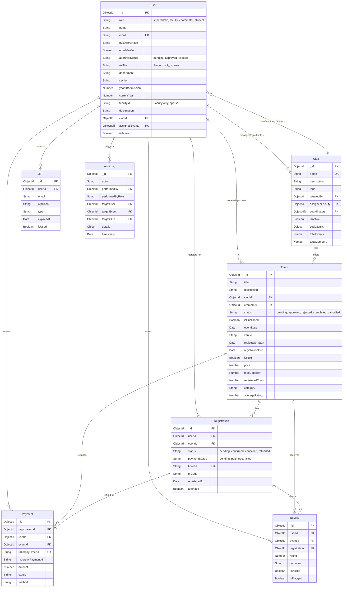

# Database Schema Documentation

This document outlines the database schema for the Campus Connect application, based on the Mongoose models located in `app/backend/models`.

## Entity Relationship Diagram

## Collections Detail

### 1. User
Stores all user information, including students, faculty, and administrators.
- **Roles**: `student`, `faculty`, `coordinator`, `superadmin`.
- **Key Fields**:
  - `email`: Unique identifier.
  - `rollNo`: Required for students (unique).
  - `facultyId`: Required for faculty (unique).
  - `approvalStatus`: Controls access (`pending`, `approved`, `rejected`).
  - `clubId`: Reference to a Club (for coordinators/faculty).

### 2. Club
Represents student clubs or organizations.
- **Key Fields**:
  - `name`: Unique club name.
  - `assignedFaculty`: Faculty mentor.
  - `coordinators`: List of student coordinators.
  - `isActive`: Toggle specifically for club visibility/activity.

### 3. Event
Core entity for events managed by clubs.
- **Status Workflow**: `pending_approval` -> `approved` -> `completed`.
- **Registration**: Controlled by `registrationStart`, `registrationEnd`, and `maxCapacity`.
- **Pricing**: Supports free and paid events via `isPaid` and `price`.

### 4. Registration
Records a user's participation in an event.
- **Uniqueness**: Composite index on `userId` + `eventId` prevents duplicate registrations.
- **Ticket**: Generates a unique `ticketId` and `qrCode`.
- **Status**: Tracks both registration status and payment status independently.

### 5. Payment
Handles financial transactions, specifically integrated with **Razorpay**.
- **Tracking**: Links `razorpayOrderId` and `razorpayPaymentId` to a `registrationId`.
- **Status**: `created`, `authorized`, `captured`, `failed`, `refunded`.

### 6. Review
Feedback system for events.
- **Constraints**: Only registered users can review (linked via `registrationId`).
- **Moderation**: Supports `isFlagged` and `isVisible` flags.

### 7. OTP
Temporary storage for One-Time Passwords.
- **Usage**: precise expiration (`expiresAt`), retry limits (`maxAttempts`), and hashing (`otpHash`).

### 8. AuditLog
System-wide audit trail for security and administrative actions.
- **Scope**: Tracks who did what (`action`), to whom (`targetUser`), and regarding what (`targetEvent`/`targetClub`).
