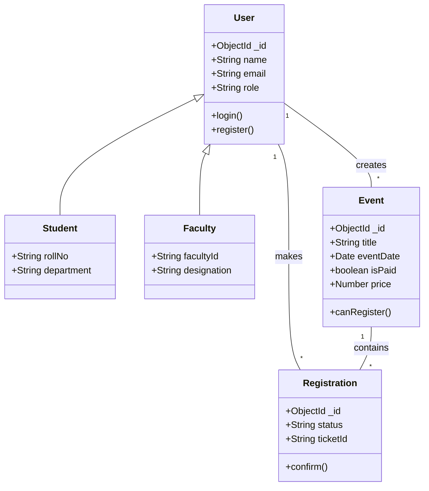
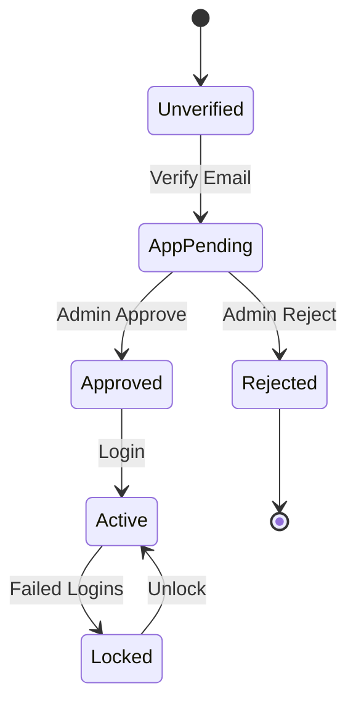
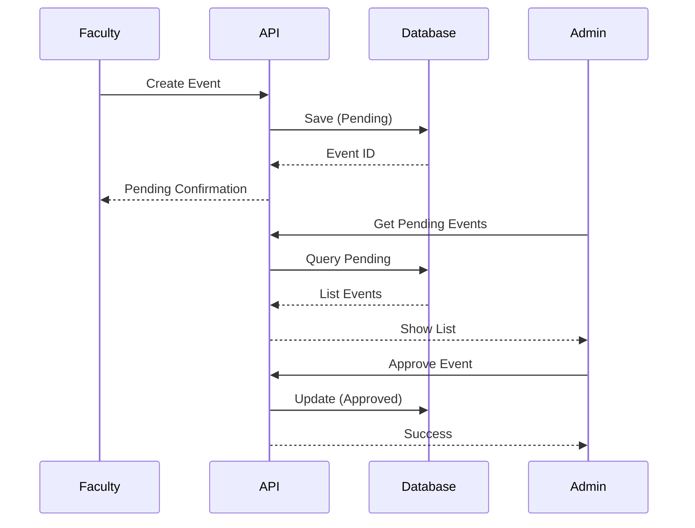
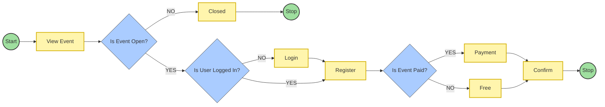

# Campus Connect - Comprehensive UML Diagrams

This document contains detailed UML diagrams for the Campus Connect application, updated to match the system's design requirements.

## 1. Use Case Diagram

Illustrates the interactions between the system and external actors.

```mermaid
graph TD
    %% Actors
    Student[/Student/]
    Faculty[/Faculty/]
    Coordinator[/Coordinator/]
    Admin[/Admin/]

    %% Use Cases
    MakePayment(Make Payment)
    VerifyEmail(Verify Email)
    ViewEvents(View Events)
    RegisterForEvent(Register for Event)
    ManageProfile(Manage Profile)
    ViewTicket(View Ticket)
    CreateEvent(Create Event)
    LoginSignup(Login / Signup)
    ApproveEvent(Approve Event)

    %% Relationships
    Student --> MakePayment
    Student --> VerifyEmail
    Student --> ViewEvents
    Student --> RegisterForEvent
    Student --> ManageProfile
    Student --> ViewTicket
    Student --> LoginSignup

    Faculty --> CreateEvent
    Faculty --> LoginSignup

    Coordinator --> LoginSignup

    Admin --> LoginSignup
    Admin --> ApproveEvent

    %% Styling to mimic the provided image
    classDef actor fill:#f9f,stroke:#333,stroke-width:2px;
    class Student,Faculty,Coordinator,Admin actor;
    
    classDef usecase fill:#fff5ad,stroke:#d4b106,stroke-width:2px;
    class MakePayment,VerifyEmail,ViewEvents,RegisterForEvent,ManageProfile,ViewTicket,CreateEvent,LoginSignup,ApproveEvent usecase;
```

## 2. Class Diagram

Detailed static structure of the database models.

## 3. State Diagram (User Approval Workflow)

Describes the lifecycle of a user account.

## 4. Sequence Diagram (Event Creation & Approval)

Shows the flow of creating an event.

## 5. Activity Diagram (Event Registration)

Detailed decision flow for registration based on user requirements.

